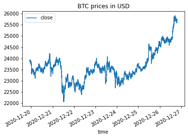
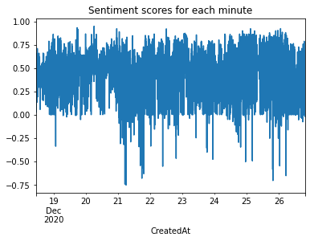

[](http://quantlet.de/)

## [](http://quantlet.de/) **SDA_2020_St_Gallen_Bitcoin_Sentiment_Analysis_Using_Tweets** [](http://quantlet.de/)

```yaml

Name of Quantlet: 'SDA_2020_St_Gallen_Bitcoin_Sentiment_Analysis_Using_Tweets'

Published in: 'SDA_2020_St_Gallen'

Description: 'Analysis of bitcoin fluctuations using sentiments from tweets that were scraped from Twitter'

Keywords: 'Twitter, Sentiment, Bitcoin, Crypto, Cryptocurrency, Scrapeing'

Author: 'Mihai Atimut, Sandor Lukacs, Arpad Gerber'

Submitted: '26 December 2020'

Input: 'The input is raw tweets. The user can choose to scrape or to use data thata was 
downoalded in advance (sample data)'

Output: 'Cross-correlation plots, scagnostics plots, sentiment graph'

```






.png)


.png)

### PYTHON Code
```python

# IMPORTING PACKAGES
import pandas as pd
from twython import Twython
from vaderSentiment.vaderSentiment import SentimentIntensityAnalyzer
import cryptocompare
from datetime import datetime, timedelta
import re
from time import *
import os
import sys
import math
import numpy as np
import matplotlib.pyplot as plt
from pyscagnostics import scagnostics
from sklearn import preprocessing
import seaborn as sns


# IMPORTANT REQUIREMENTS
os.environ['TZ'] = 'Europe/London'
#os.chdir("")

"""
INSTALL THE FOLLOWING PACKAGES
pip install twython
pip install vaderSentiment
pip install cryptocompare
pip install seaborn
pip install sklearn
pip install pyscagnostics
"""


# PLEASE SET WORKING DIRECTORY PRIOR TO THE RUN
#os.chdir("")


############################################################################
############################ DEFINING FUNCTIONS ############################
############################################################################

def ExtractTweets(sample=True):
    
    # If the user chose to use the sample tweets
    if sample == True:
        tweets = pd.read_csv("BTC/tweets_sample.csv")
        
        
    else:

        # Setting up Twitter API
        APP_KEY = 'z5W0ogHsEpx12EPZAgCTLXOWd'
        APP_SECRET = 'eLVZazK5i2we9s0jlIflBSSeNaZwi1Yfns3UXlOb0Qvue1q5CQ'
        twitter = Twython(APP_KEY, APP_SECRET, oauth_version=2)
        ACCESS_TOKEN = twitter.obtain_access_token()
        twitter = Twython(APP_KEY, access_token=ACCESS_TOKEN)

        api_limit = twitter.get_application_rate_limit_status()['resources']['search']['/search/tweets']['remaining']
        if api_limit != 450:
            print("\nPlease wait 15 minutes until API limit recharges")
            CountDown(910)
            print("Scraping starts...\n")
            
        # Setting up the extraction
        # Variables to keep track
        nruns = 450
        COUNT_OF_TWEETS_TO_BE_FETCHED = 45000 
        i = 1
        
        with open("BTC/tweets_raw.csv", mode="w+") as f:
            f.write("ID,Text,Fovor,Retw,CreatedAt\n")
        f.close()
        
        try:

            count = 0
        
            while(True):
                twitter = Twython(APP_KEY, access_token=ACCESS_TOKEN)
                for i in range(0,nruns-1):
                    
                    # Reset data buffers (one for each dataframe column)
                    ids  = []
                    text = []
                    fav  = []
                    retw = []
                    time = []
            
                    if(COUNT_OF_TWEETS_TO_BE_FETCHED < len(ids)):
                        break 
            
                    # If it is the first iteration, download the 100 most
                    # recent tweets
                    if(i == 0 and count == 0):
                        results = twitter.search(q="#btc",count='100', lang="en")
                    
                    # If it is not the first iteration:
                    # Pass the oldest tweets id to the max_id parameter
                    # Download the 100 tweets before the max_id
                    else:
                        # After the first call we should have max_id from result 
                        # of previous call. Pass it in query.
                        results = twitter.search(q="#btc",include_entities='true',
                                                 count='100', max_id=next_max_id,
                                                 lang="en")
                        
                    count = count + 1    
                    # Counter to track the scraper extraction
                    sys.stdout.write("\rScraped {0} out of 45000".format((i+2)*100))
                    sys.stdout.flush()
            
                    # Loop trough the results and extract the needed data
                    
                    for result in results['statuses']:
            
            
                        ids.append(result["id"])
                        text.append(result['text'].replace("\n","").replace("\r",""))
                        fav.append(result['favorite_count'])
                        retw.append(result['retweet_count'])
                        time.append(result["created_at"])
                        
                    df_tweets = pd.DataFrame({'id': ids,
                         'text': text,
                         'fav': fav,
                         'retw': retw,
                         'time': time})
            
            
                    df_tweets.to_csv("BTC/tweets_raw.csv", mode="a", index=False,
                                     sep=",", encoding='utf-8',header=False)
            
                    # STEP 3: Get the next max_id
                    try:
                        # Parse the data returned to get max_id to 
                        # be passed in consequent call.
                        next_results_url_params = results['search_metadata']['next_results']
                        next_max_id = next_results_url_params.split('max_id=')[1].split('&')[0]
                        flag = False
                    except:
                        
                        # No more next pages
                        print("No more tweets available")
                        flag = True
                        break
                        
            
                if flag == True:
                    break
                # If API limit is reached the script waits for 15 minutes to reset limit
                print("\rAPI limit reached, waiting 15 minutes")
                CountDown(910)
            
        except KeyboardInterrupt:
            pass
        
        tweets = pd.read_csv("BTC/tweets_raw.csv")        
    return(tweets)

'''
# Function CountDown: Script to make a countdown timer
# Arguments: t: seconds to count down
'''   
def CountDown(t):
    while t:
        mins, secs = divmod(t, 60)
        timeformat = '{:02d}:{:02d}'.format(mins, secs)
        sys.stdout.write("\r{0}".format(timeformat))
        sys.stdout.flush()
        sleep(1)
        t -= 1

'''   
# Function CleanseTweets: Clean the text of the tweets to be ready for the sentiment analysis
# Arguments: df: The dataframe containing the raw tweets from the ExtractTweets function
'''   
def CleanseTweets(df):
    
    local_tweets = df
    
    # Removing hashtags and retweets
    df.Text = [tweet.replace("#", "").replace("RT", "") for tweet in df.Text]
    
    # Removing most URLs and user taggings
    local_tweets['Text'] = local_tweets['Text'].apply(lambda
                                                      x: re.split('https:\/\/.*',
                                                                  str(x))[0])
    local_tweets['Text'] = local_tweets['Text'].apply(lambda
                                                      x: re.sub("@[A-Za-z0-9]+","",
                                                                str(x)))
        
    return(local_tweets)


'''   
# Function AnalyzeSentiment: Calculates the sentiment score for each tweet in the dataframe
# Arguments: df
'''   
def AnalyzeSentiment(df):
    
    # Creating a local instance of the tweets
    local_tweets = df
    
    # Initializing Vader class for analyzing sentiments
    analyzer = SentimentIntensityAnalyzer()
    
    # Creating containers for the results
    pos = []
    neg = []
    neu = []
    compound = []
    counter = 1
    
    for tweet in local_tweets.Text:
        #sys.stdout.write("\rAnalyzed {0} scores out of {1}".format(counter,
        #                                                           len(local_tweets)))
        #sys.stdout.flush()
        vs = analyzer.polarity_scores(tweet)
        pos.append(vs['pos'])
        neg.append(vs['neg'])
        neu.append(vs['neu'])
        compound.append(vs['compound'])
    
        counter = counter + 1
    
    df_tweets_analyzed = pd.DataFrame({'neg':neg,
                                       'pos':pos,
                                       'neu':neu,
                                       'compound':compound})
    
    df_tweets_concat = pd.concat([local_tweets, df_tweets_analyzed], axis = 1)     
    return(df_tweets_concat)

'''   
# Function WeightedSentiment: Calculates the weighted average sentiment by retweet count
# Arguments: df
'''   
def WeightedSentiment(df):
    # Creating a local instance of the tweets
    weight = df['Retw'].values+1
    if not list(weight):
        return(0)
    elements = df['compound'].values
    weighted_sentiment = sum(weight*elements)/sum(weight)
    return(weighted_sentiment)

'''   
# Function ResampleDataframe: Calculates the minutely sentiment
# Arguments: df
''' 
def ResampleDataframe(df):
    
    # Creating a local instance of the tweets
    local_tweets = df
    
    local_tweets['CreatedAt'] = pd.to_datetime(local_tweets['CreatedAt'])
    local_tweets = local_tweets.set_index('CreatedAt')
    
    return(local_tweets.groupby(pd.Grouper(freq='1Min')).apply(WeightedSentiment))
    
'''   
# Function FetchCryptoprices: Gets the cryptocurrency (BTC) prices
# Arguments: num: number of minutes to be fetched
'''   
def FetchCryptoprices(df, sample):
    
    if sample == "yes":
        btc_prices = pd.read_csv("BTC/crypto_prices.csv", sep=",")
        
        btc_prices.reset_index(inplace=True)
       
        btc_prices['time'] = [datetime.strptime(ts, '%Y-%m-%d %H:%M:%S') for ts in btc_prices['time']]
    
        btc_prices = btc_prices.set_index('time')
        
        btc_prices.drop("index", axis=1, inplace=True)
    
    else:

        num = df.size
        recent = df.index[-1].to_pydatetime()+timedelta(minutes=1)
        num_of_iterations = math.ceil(num/2000)
        last_limit = num-(num_of_iterations - 1)*2000
        btc_prices = pd.DataFrame(columns=['time','close'])
        
        
        
        for i in list(range(num_of_iterations)):
            btc_time  = []
            btc_high  = []
            btc_low   = []
            btc_open  = []
            btc_close = []
            flag = False
            
            if i==0:
                
                btc = cryptocompare.get_historical_price_minute('BTC', 'USD', limit=2000,
                                                          exchange='CCCAGG', toTs=recent)
                
                for x in range(2000):
                    btc_time.append(btc[x]['time'])
                    btc_high.append(btc[x]['high'])
                    btc_low.append(btc[x]['low'])
                    btc_open.append(btc[x]['open'])
                    btc_close.append(btc[x]['close'])
            
            elif i != (num_of_iterations-1):
                btc = cryptocompare.get_historical_price_minute('BTC', 'USD', limit=2000,
                                                          exchange='CCCAGG', toTs=last_index)
    
                for x in range(2000):
    
                    try:
                        btc_time.append(btc[x]['time'])
                        btc_high.append(btc[x]['high'])
                        btc_low.append(btc[x]['low'])
                        btc_open.append(btc[x]['open'])
                        btc_close.append(btc[x]['close'])
                    except:
                        flag = True
                        break
    
                
                if flag == True:
    
                    btc_prices = btc_prices.append(pd.DataFrame({'time':btc_time, 'close':btc_close}).iloc[::-1])
                    break
                    
            else: 
                
                btc = cryptocompare.get_historical_price_minute('BTC','USD', limit = last_limit,
                                                                exchange ='CCCAGG',toTs=last_index)
       
                for x in range(last_limit):
                    try:
                        btc_time.append(btc[x]['time'])
                        btc_high.append(btc[x]['high'])
                        btc_low.append(btc[x]['low'])
                        btc_open.append(btc[x]['open'])
                        btc_close.append(btc[x]['close'])
                    except:
                        flag = True
                        break
                
                if flag == True:
    
                    btc_prices = btc_prices.append(pd.DataFrame({'time':btc_time, 'close':btc_close}).iloc[::-1])
                    break
                    
            
            last_index = datetime.utcfromtimestamp(int(btc[0]['time']))
    
            btc_prices = btc_prices.append(pd.DataFrame({'time':btc_time, 'close':btc_close}).iloc[::-1])
            
        btc_prices.reset_index(inplace=True)
            
        btc_prices['time'] = [datetime.utcfromtimestamp(int(ts)) for ts in btc_prices['time']]
    
        btc_prices = btc_prices.set_index('time')
        
        btc_prices.drop("index", axis=1, inplace=True)
    
    return(btc_prices)


'''   
# Function FinalizeData: Unifies minutely sentiment and prices, calculates returns and volatility
# Arguments: sentiment, prices
''' 
def FinalizeData(sentiment, prices):
    
    prices = prices[~prices.index.duplicated(keep='first')]
    sentiment = sentiment.iloc[::-1].tz_convert(None)
    
    sentiment = pd.DataFrame(sentiment[:len(prices)])
    
    final_dataframe = pd.concat([sentiment,prices], axis = 1)
    final_dataframe.columns = ['Sentiment', 'Close']
    
    final_dataframe['Return'] = np.log(final_dataframe.Close) - np.log(final_dataframe.Close.shift(1))
    final_dataframe['Vola'] = final_dataframe["Return"] * final_dataframe["Return"]
    
    return(final_dataframe)

'''   
# Function CreateCorrelplots: Creates plots for cross-correllation
# Arguments: df
''' 
def CreateCorrelplots(df, name):
    
    local_df = df
    
    
    for i in np.arange(-20,21):
        return_name = "Retur_"+str(i)
        volat_name = "Volat_"+str(i)
        local_df[return_name] = local_df['Return'].shift(i)
        local_df[volat_name] = local_df['Vola'].shift(i)
        
    corre_matrix = local_df.corr()
        
    correllations = pd.DataFrame(index=np.arange(-20,21), columns=["Return", "Volatility"])
    
    for i in correllations.index:
        correllations['Return'][i] = corre_matrix['Retur_'+str(i)]['Sentiment']
        correllations['Volatility'][i] = corre_matrix['Volat_'+str(i)]['Sentiment']
        
    ax = correllations.plot(title="Cross-correlation between sentiment and various lags"+name)
    ax.set_xlabel("Lags")
    ax.set_ylabel("Correlation")
    return()

'''   
# Function create_scagnostics: Creates scagnostics plots
# Arguments: df
''' 
def create_scagnostics(df, name):

    outlying  = []
    skewed    = []
    clumpy    = []
    sparse    = []
    striated  = []
    convex    = []
    skinny    = []
    monotonic = []
    names     = []
    
    all_measures = scagnostics(df[['Sentiment', 'Close','Return', 'Vola']])
    
    for measures in all_measures:

        names.append(measures[0]+" vs "+measures[1])
        outlying.append(measures[2][0]["Outlying"])
        skewed.append(measures[2][0]["Skewed"])
        clumpy.append(measures[2][0]["Clumpy"])
        sparse.append(measures[2][0]["Sparse"])
        striated.append(measures[2][0]["Striated"])
        convex.append(measures[2][0]["Convex"])
        skinny.append(measures[2][0]["Skinny"])
        monotonic.append(measures[2][0]["Monotonic"])

    d = {"Names":names, "Outlying":outlying, "Skewed":skewed, "Clumpy":clumpy, "Sparse":sparse, "Striated":striated, "Convex":convex, "Skinny":skinny,"Monotonic":monotonic}
    scagnostics_df = pd.DataFrame(d)
    scagnostics_df.set_index('Names', inplace=True)
    a4_dims = (11.7, 8.27)
    fig, ax = plt.subplots(figsize=a4_dims)
    sns.heatmap(scagnostics_df, yticklabels=True, cmap= 'RdBu_r',vmin=0, vmax=1)

    plt.title("Scagnostic plot for data "+name)

    return(all_measures)


'''   
# Function CreateDerivative: Create derivative of each column of a dataframe
# Arguments: df
''' 
def CreateDerivative(df):
    
    local_df = df.copy()
    
    for column in local_df.columns:
    
        local_df[column] = np.gradient(local_df[column].values)

    return(local_df)


        
        
############################################################################
############################### MAIN PROGRAM ###############################
############################################################################

# Clearing the terminal
os.system('cls' if os.name=='nt' else 'clear')

# STEP 1: Getting Tweets
print("Step 1: Scraping Twitter")
print("--------------------------------------------------------------")
print("Scraping all available raw tweets takes around 2.5 hours.")
prompt = input("Would you like to use preapred and processed sample data instead? (yes/no): ")

if prompt == "yes":
    tweets = ExtractTweets(True)
else:
    print("\nYou can quit the scraping anytime by hitting ctr+c, but code only works if the first 45k tweets are downloaded")
    tweets = ExtractTweets(False)

#STEP 2: Cleansing Tweets
print("\n\nStep 2: Cleaning the tweets")
print("--------------------------------------------------------------")
cleaned_tweets = CleanseTweets(tweets)
print(str(len(tweets)) + " " + "tweets cleaned")

#STEP 3: Creating Sentiment
print("\n\nStep 3: Calculating raw sentiment scores")
print("--------------------------------------------------------------")
analyzed_tweets = AnalyzeSentiment(cleaned_tweets)

#STEP 4: Calculating minutely sentiment
print("\n\nStep 4: Aggregating sentiment by the minute and weighting by the number of retweets")
print("--------------------------------------------------------------")
sentiment_tweets = ResampleDataframe(analyzed_tweets)
sentiment_tweets.plot(title="Sentiment scores for each minute")

if(len(sentiment_tweets)<2000):
    
    sys.exit("Not enough tweets downloaded! Please download at lest the first 45000")

#STEP 5: Fetching Crypto Prices
print("\n\nStep 5: Fetching Cryptocurrency data")
print("--------------------------------------------------------------")
crypto_prices = FetchCryptoprices(sentiment_tweets, prompt)
crypto_prices.plot(title="BTC prices in USD")

#STEP 6: Unify dataframes: tweets, sentiment, prices. And create features: return, vola, lagged return
print("\n\nStep 6: Creating outcome variables: returns, volatility, and lagged returns")
print("--------------------------------------------------------------")
final_dataframe = FinalizeData(sentiment_tweets, crypto_prices)

#STEP 7: Creating Derivative Measures
print("\n\nStep 7: Creating a derivative measures")
print("--------------------------------------------------------------")
final_derivative = CreateDerivative(final_dataframe)

#STEP 8: Scagnostics
print("\n\nStep 8: Creating a scagnostics plot for data")
print("--------------------------------------------------------------")
print("All plots are shown after the code run")
create_scagnostics(final_dataframe,"")
create_scagnostics(final_derivative,"(Derivative)")

#STEP 8: Defining an autocorrellaton measure
print("\n\nStep 8: Generating autocorrellation plots")
print("--------------------------------------------------------------")
print("All plots are shown after the code run")
CreateCorrelplots(final_dataframe, "")
CreateCorrelplots(final_derivative," (derivative)")


```

automatically created on 2020-12-30