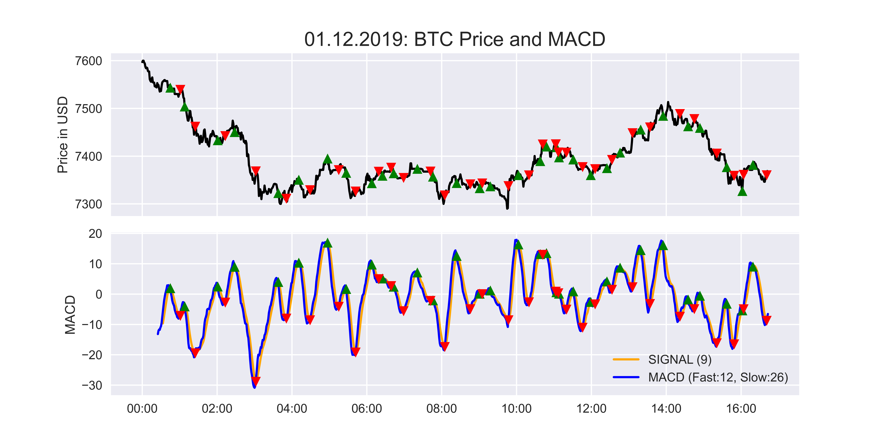
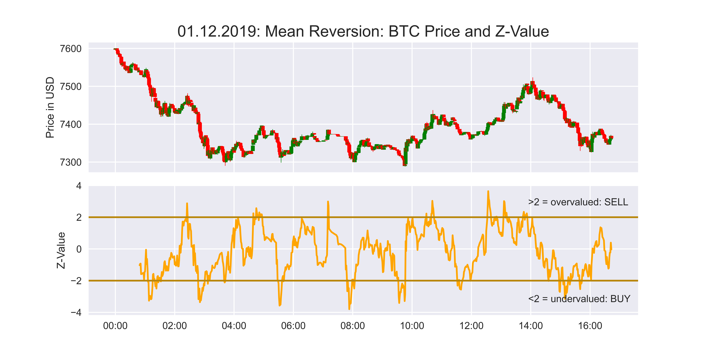
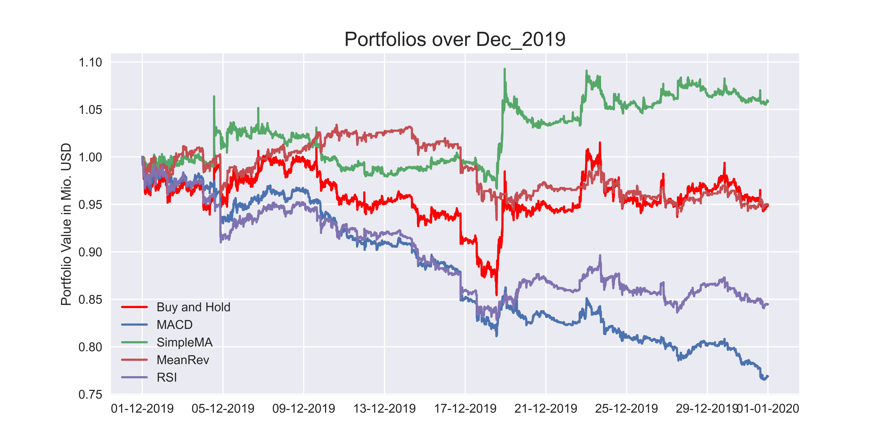
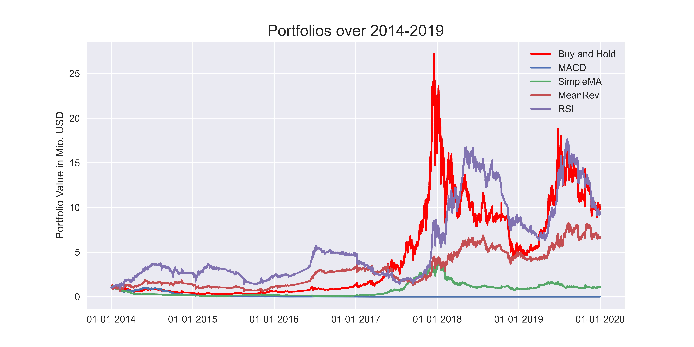
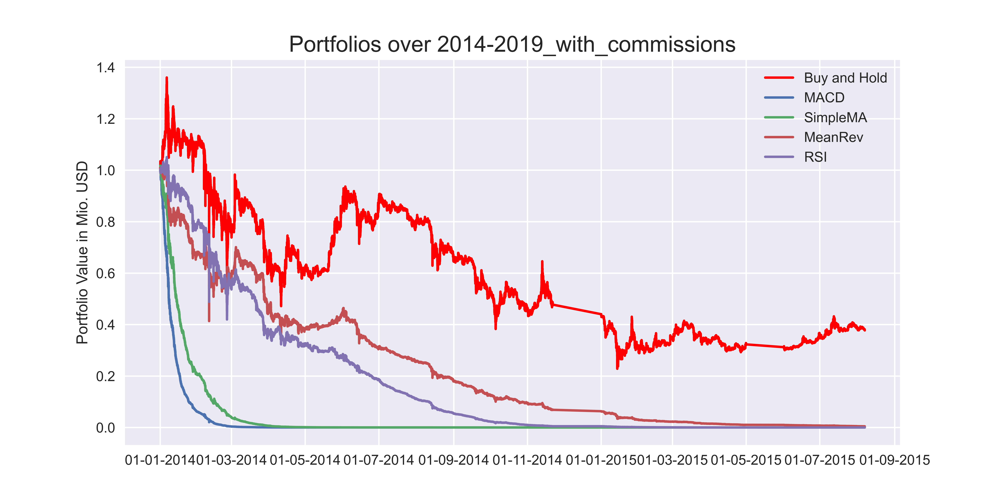
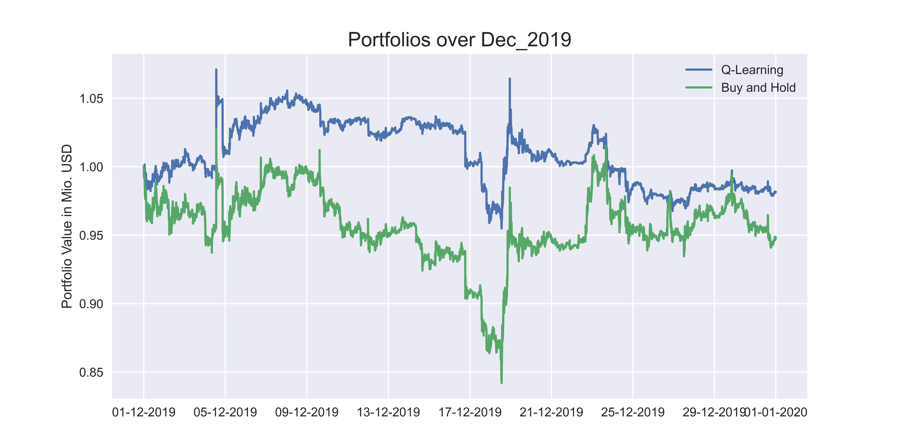
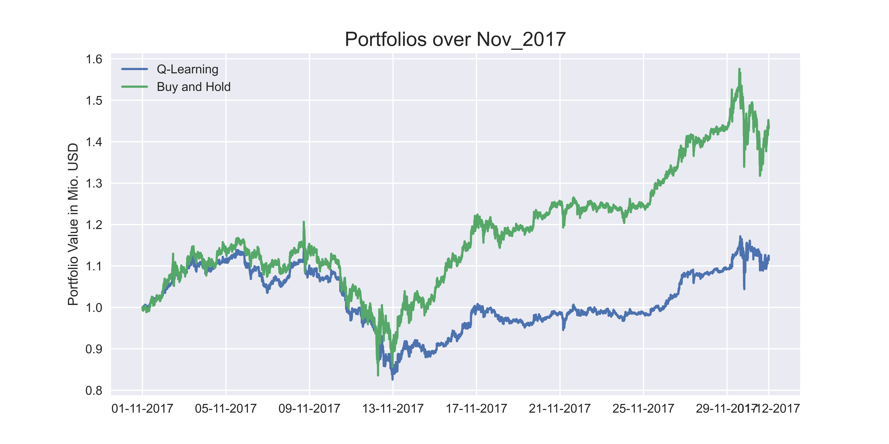
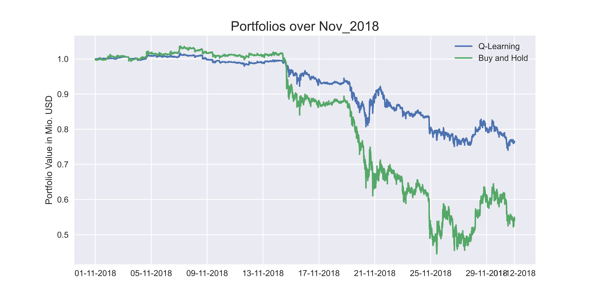
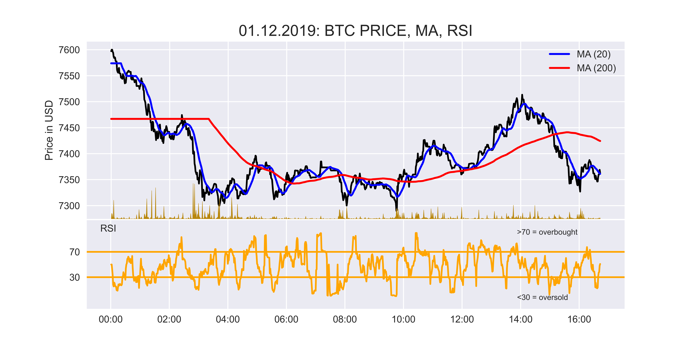
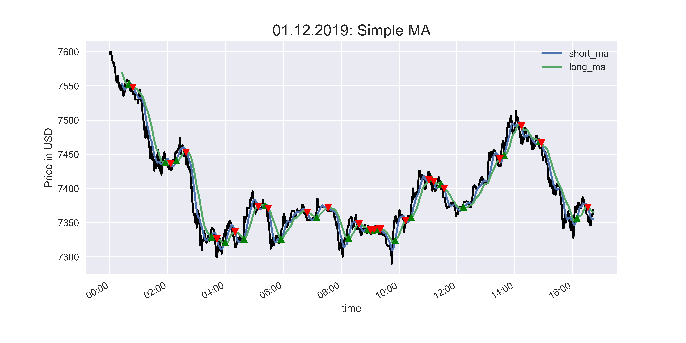

[](http://quantlet.de/)

## [](http://quantlet.de/) **SDA_2020_St_Gallen_03_VisualizeSimulations** [](http://quantlet.de/)

```yaml

Name of Quantlet: SDA_2020_St_Gallen_03_VisualizeSimulations

Published in: SDA_2020_St_Gallen_CryptoBot

Description: Plotting various perfomance graphes for simulated technical trading strategies. This quantlet should ideally be executed after SDA_2020_St_Gallen_01_DataImport.

Keywords: QLearning, Trading Bot, BTC, Bitcoin, Timeseries, Technical Indicators

Author: Tobias Mann, Tim Graf

See also: SDA_2020_St_Gallen_01_DataImport, SDA_2020_St_Gallen_02_Simulations, SDA_2020_St_Gallen_04_VisualizeMonteCarlo

Submitted:  'Sun , January 03 2020 by Tobias Mann and Tim Graf'

Datafile: '../Data/Dec19.csv'

Output:  './Outputs/Q_LEARNING_Dec_2019.png, ./Outputs/simpeMA_Dec_2019.png, ./Outputs/MACD_Dec_2019.png, ./Outputs/RSI_Dec_2019.png, ./Outputs/MEANREVERSION_Dec_2019.png, ./Outputs/MEANREVERSION_Dec_2019.png, ./Outputs/PORTFOLIOS_Dec_2019.png, ./Outputs/OVERVIEW_Dec_2019.png'

```






















### PYTHON Code
```python

import pandas as pd
import numpy as np
import matplotlib.pyplot as plt
import matplotlib.dates as mdates
from matplotlib.dates import DateFormatter
import matplotlib.gridspec as gridspec
from matplotlib.pylab import date2num
from mplfinance.original_flavor import candlestick_ohlc
import os


# DATA IMPORT  --------------------------

# set the Time Period and Output path
TIMEPERIOD = 'Dec_2019'
PATH_PLOTS = './Outputs/'

# define the inputs
df = pd.read_csv('../SDA_2020_St_Gallen_02_Simulations/Output_Dec_2019/strategies_indicators.csv')
df1 = pd.read_csv('../Data/Dec19.csv')
df1 = df1[pd.to_datetime(df1.time).agg(lambda x: x.year != 2013).values]
df['time'] = pd.to_datetime(df['time'])
df1['cumreturn'] = np.log(1 + df1['close'].pct_change()).cumsum()


# feature engineering
df['open'] = df1['open']
df['high'] = df1['high']
df['low'] = df1['low']
df['close'] = df1['close']
df['volume'] = df1['volume']
df['cumreturn'] = np.log(1+df['close'].pct_change()).cumsum()
df['time'] = pd.to_datetime(df['time'])
df['value'] = 1e6 * (1+df['cumreturn'])
df.set_index('time', inplace=True, drop=True)
cols = ['open', 'high', 'low', 'close', 'volume', 'macd', 'signal', 'short_ma', 'long_ma',
    'z_value', 'rsi', 'cumreturn', 'value']

df = df[cols]
df = df.head(1000)

# Set overall Plots ---------------------

plt.style.use("seaborn")

TEXTSIZE = 10
FONTSIZE_TITLES = 16
FIGSIZE = (10, 5)
MARKERSIZE = 8
TIME_FMT = mdates.DateFormatter('%H:%M')

if os.path.isdir(PATH_PLOTS):
    pass
else:
    os.mkdir(PATH_PLOTS)

plt.close("all")


# FUNCTIONS --------------------

def moving_average(x, n, type='simple'):
    x = np.asarray(x)
    if type == 'simple':
        weights = np.ones(n)
    else:
        weights = np.exp(np.linspace(-1., 0., n))

    weights /= weights.sum()

    a = np.convolve(x, weights, mode='full')[:len(x)]
    a[:n] = a[n]
    return a

def find_csv_filenames(path_to_dir, suffix=".csv"):
    filenames = listdir(path_to_dir)
    return [filename for filename in filenames if filename.endswith(suffix)]


# SIMPLE MOVING AVERAGES --------------------------

short_window = 12
long_window = 26
df['signal_point'] = 0.0

# Create signals, 1.0 = Signal, 0.0 = No signal
df['signal_point'][short_window:] = np.where(
    df['short_ma'][short_window:] > df['long_ma'][short_window:], 1.0, 0.0)

# Generate trading orders
df['positions'] = df['signal_point'].diff()
df.loc[df['positions'] == 1]
df.loc[df['positions'] == 0]
df.loc[df['positions'] == -1]
# 0 = do nothing, 1 = Buy, 2 = Sell

# Initialize the plot figure
fig = plt.figure(num=None,
                 figsize= FIGSIZE,
                 dpi=80,
                 facecolor='w',
                 edgecolor='k')
# Add a subplot and label for y-axis
ax1 = fig.add_subplot(111, ylabel='Price in USD', xlabel = None)
ax1.set_title(TIMEPERIOD + ': Simple MA', fontsize = FONTSIZE_TITLES)

#ax1.margins(x=-0.4, y=--0.4)
# Plot the closing price
df['close'].plot(ax=ax1, color='black', lw=2.)

# Plot the short and long moving averages
df[['short_ma', 'long_ma']].plot(ax=ax1, lw=2.)

# Plot the buy signals
ax1.plot(df.loc[df.positions == 1.0].index,
         df.short_ma[df.positions == 1.0],
         '^',
         markersize=MARKERSIZE,
         color='g')

# Plot the sell signals
ax1.plot(df.loc[df.positions == -1.0].index,
         df.short_ma[df.positions == -1.0],
         'v',
         markersize=MARKERSIZE,
         color='r')

ax1.locator_params(axis='x', nbins=10)
ax1.xaxis.set_major_formatter(TIME_FMT)

# Show and save the plot
plt.show()
fig.savefig(PATH_PLOTS + 'SIMPLEMA_' + TIMEPERIOD + '.png', dpi = 1000)

# MACD --------------------------

FAST = 12
SLOW = 26
SIGNAL = 9
MACD_NAME = 'MACD (Fast:' + str(FAST) + ', Slow:' + str(SLOW) + ')'
SIGNAL_NAME = 'SIGNAL (' + str(SIGNAL) + ')'

df['signal_point'] = 0.0

# Create signals, 1.0 = Signal, 0.0 = No signal
df['signal_point'][SLOW:] = np.where(
    df['signal'][SLOW:] > df['macd'][SLOW:], 1.0, 0.0)

# Generate trading orders
df['positions'] = df['signal_point'].diff()
df.loc[df['positions'] == 1]
df.loc[df['positions'] == 0]
df.loc[df['positions'] == -1]
# 0 = do nothing, 1 = Buy, 2 = Sell

# Upper Subplot
fig, (ax1, ax2) = plt.subplots(2, figsize= FIGSIZE, sharex = True)
plt.subplots_adjust(wspace=0, hspace=0.1)
ax1.set_title(TIMEPERIOD + ': BTC Price and MACD', fontsize=FONTSIZE_TITLES)
ax1.plot(df.index, df['close'], color = 'black')
ax1.set_ylabel('Price in USD')

# Lower Subplot
ax2.plot(df.index, df['signal'], color='orange', label = SIGNAL_NAME)
ax2.plot(df.index, df['macd'], color='blue', label = MACD_NAME)
ax2.set_ylabel('MACD')

# PRICE PLOT ---
# Plot the Buy Signals
ax1.plot(df.loc[df.positions == 1.0].index,
         df.close[df.positions == 1.0],
         '^',
         markersize=MARKERSIZE,
         color='g')

# Plot the sell signals
ax1.plot(df.loc[df.positions == -1.0].index,
         df.close[df.positions == -1.0],
         'v',
         markersize=MARKERSIZE,
         color='r')

# MACD PLOT ---
# Plot the Buy Signals
ax2.plot(df.loc[df.positions == 1.0].index,
         df.signal[df.positions == 1.0],
         '^',
         markersize=MARKERSIZE,
         color='g')

# Plot the sell signals
ax2.plot(df.loc[df.positions == -1.0].index,
         df.signal[df.positions == -1.0],
         'v',
         markersize=MARKERSIZE,
         color='r')

ax2.locator_params(axis='x', nbins=10)
ax2.xaxis.set_major_formatter(TIME_FMT)

plt.legend()

# plot and save
plt.show
fig.savefig(PATH_PLOTS + 'MACD_' + TIMEPERIOD + '.png', dpi = 1000)


# RSI -----------------------------------

# Configure variables
FILLCOLOR = 'darkgoldenrod'
TEXTSIZE = 10

# Define variables
prices = df['close']
rsi = df['rsi']

# Set up plot
fig = plt.figure(figsize = FIGSIZE)
gs = gridspec.GridSpec(2, 1, height_ratios=[2, 1])
ax1 = plt.subplot(gs[0])
ax2 = plt.subplot(gs[1])
ax2t = ax1.twinx()  # Create a new Axes instance with an invisible x-axis and an independent y-axis positioned opposite to the original one (i.e. at right)
plt.subplots_adjust(wspace=0, hspace=0.01)
ax1.set_title(TIMEPERIOD + ': BTC PRICE, MA, RSI', fontsize=FONTSIZE_TITLES)
ax2.xaxis.set_major_formatter(mdates.DateFormatter("%d-%m-%Y"))

# Plot the Price
ax1.plot(df.index, df['close'], color='black')
ax1.set_ylabel('Price in USD')

# Plot the MA
ma1 = moving_average(prices, 20, type='simple')
ma2 = moving_average(prices, 200, type='simple')
linema20, = ax1.plot(df.index, ma1, color='blue', lw=2, label='MA (20)')
linema200, = ax1.plot(df.index, ma2, color='red', lw=2, label='MA (200)')

# Plot the volume
volume = (df.close * df.volume) / 1e6  # dollar volume in millions
vmax = volume.max()
ax2t.fill_between(df.index, volume, label='Volume', facecolor=FILLCOLOR, edgecolor=FILLCOLOR)
ax2t.set_ylim(0, 5 * vmax)
ax2t.set_yticks([]) # sets secondary axis = 0
# ax2t.set_ylabel("Volume")

# plot the rsi
ax2.plot(df.index, rsi, color='orange')
ax2.axhline(70, color='orange')
ax2.axhline(30, color='orange')
ax2.text(0.8, 0.9,'>70 = overbought', va='top', transform=ax2.transAxes, fontsize=TEXTSIZE-2)
ax2.text(0.8, 0.1,'<30 = oversold', transform=ax2.transAxes, fontsize=TEXTSIZE-2)
ax2.set_ylim(-20, 120)
ax2.set_yticks([30, 70])
ax2.text(0.025, 0.95, 'RSI', va='top',transform=ax2.transAxes,fontsize=TEXTSIZE)

# add legend
ax1.legend()

ax2.locator_params(axis='x', nbins=10)
ax2.xaxis.set_major_formatter(TIME_FMT)

# show and save plot
plt.show()
fig.savefig(PATH_PLOTS + 'RSI_' + TIMEPERIOD + '.png', dpi=1000)


# MEAN REVERSION -------------------------------------------

df['signal_point'] = 0.0
z_values = df['z_value']

# Get nested list of date, open, high, low and close prices
ohlc = []
for date, row in df.iterrows():
    openp, highp, lowp, closep = row[:4]
    ohlc.append([date2num(date), openp, highp, lowp, closep])

# Upper Subplot
fig, (ax1, ax2) = plt.subplots(2, figsize = FIGSIZE, sharex = True)
plt.subplots_adjust(wspace=0, hspace=0.1)
ax1.set_title(TIMEPERIOD +': Mean Reversion: BTC Price and Z-Value', fontsize = FONTSIZE_TITLES)
candlestick_ohlc(ax1, ohlc, colorup="g", colordown="r", width=0.005,)

#ax1.plot(df.index, df['close'], color='black')
ax1.set_ylabel('Price in USD')

# Lower Subplot
ax2.plot(df.index, z_values, color='orange', label='Z-Value')
ax2.axhline(2, color=FILLCOLOR)
ax2.axhline(-2, color=FILLCOLOR)
ax2.set_ylabel('Z-Value')
ax2.text(0.8, 0.9,'>2 = overvalued: SELL', va='top', transform=ax2.transAxes, fontsize=TEXTSIZE)
ax2.text(0.8, 0.1,'<2 = undervalued: BUY', transform=ax2.transAxes, fontsize=TEXTSIZE)

ax2.locator_params(axis='x', nbins=10)
ax2.xaxis.set_major_formatter(TIME_FMT)

plt.show()
fig.savefig(PATH_PLOTS + 'MEANREVERSION_' + TIMEPERIOD + '.png', dpi=1000)


# ALL TOGETHER PLOTS ----------------------------------------------

FILLCOLOR = 'darkgoldenrod'
FAST = 12
SLOW = 26
SIGNAL = 9
MACD_NAME = 'MACD (Fast:' + str(FAST) + ', Slow:' + str(SLOW) + ')'
SIGNAL_NAME = 'SIGNAL (' + str(SIGNAL) + ')'

# Create figure and set axes for subplots
fig = plt.figure(figsize = (10,10))
gs = gridspec.GridSpec(nrows = 4, ncols =1, height_ratios=[2, 1, 1, 1])

# create axis
ax_candle = plt.subplot(gs[0])
ax_candle.set_xticks(df.index)
ax_macd = plt.subplot(gs[1], sharex = ax_candle)
ax_rsi = plt.subplot(gs[2], sharex = ax_candle)
ax_z_value = plt.subplot(gs[3], sharex = ax_candle)
ax_vol = ax_candle.twinx()  # Create a new Axes instance with an invisible x-axis and an independent y-axis positioned opposite to the original one (i.e. at right)


# Get nested list of date, open, high, low and close prices
ohlc = []
for date, row in df.iterrows():
    openp, highp, lowp, closep = row[:4]
    ohlc.append([date2num(date), openp, highp, lowp, closep])

# Plot candlestick chart
ax_candle.plot(df.index, df["short_ma"], label="MA 12")
ax_candle.plot(df.index, df["long_ma"], label="MA 26")
candlestick_ohlc(ax_candle, ohlc, colorup="g", colordown="r", width=0.005,)
ax_candle.set_title(TIMEPERIOD + ': Candlestick (OHLC)')
ax_candle.legend()
ax_candle.set_ylabel('Price in USD')

# Create signals, 1.0 = Signal, 0.0 = No signal
df['signal_point'] = 0.0
df['signal_point'][SLOW:] = np.where(df['signal'][SLOW:] > df['macd'][SLOW:], 1.0, 0.0)

# Generate trading orders
df['positions'] = df['signal_point'].diff()

# Plot MACD
ax_macd.plot(df.index, df["macd"], label= MACD_NAME)
ax_macd.plot(df.index, df["signal"], label= SIGNAL_NAME)
ax_macd.legend(loc = 2)
ax_macd.set_ylabel('MACD')

# Plot the Buy Signals
ax_macd.plot(df.loc[df.positions == 1.0].index,
             df.signal[df.positions == 1.0],
             '^',
             markersize=MARKERSIZE,
             color='g')

# Plot the sell signals
ax_macd.plot(df.loc[df.positions == -1.0].index,
             df.signal[df.positions == -1.0],
             'v',
             markersize=MARKERSIZE,
             color='r')

# Plot RSI
# Above 70% = overbought, below 30% = oversold
ax_rsi.set_ylabel("(RSI %)")
ax_rsi.plot(df.index, [70] * len(df.index), label="overbought", color = 'grey', linewidth = 0.5)
ax_rsi.plot(df.index, [30] * len(df.index), label="oversold", color = 'grey', linewidth = 0.5)
ax_rsi.plot(df.index, df["rsi"], label="rsi")

# Plot z-score
ax_z_value.plot(df.index, df['z_value'], color='orange', label='Z-Value')
ax_z_value.axhline(2, color='grey', linewidth=0.5)
ax_z_value.axhline(-2, color='grey', linewidth=0.5)
ax_z_value.set_ylabel('Z-Value')

# Show volume in millions
volume = df['volume'] / 1e6
ax_vol.fill_between(df.index, volume, label='Volume in Mio.', facecolor=FILLCOLOR, edgecolor=FILLCOLOR)
# ax_vol.set_ylabel("(Million)")
vmax = volume.max()
ax_vol.set_ylim(0, 5 * vmax)

# Format x-axis ticks as dates
TIME_FMT = mdates.DateFormatter('%H:%M')
ax_candle.locator_params(axis='x', nbins=10)
ax_candle.xaxis.set_major_formatter(TIME_FMT)

# Show and plot
plt.show()
fig.savefig(PATH_PLOTS + 'OVERVIEW_' + TIMEPERIOD + '.png', dpi = 1200)


# PLOTTING THE PORTFOLIOS OF SIMPLE TRADING STRATEGIES ----------------------------------------------

# Please change the input variables to get the wanted Porfolio
TIMEPERIOD = 'Dec_2019'
TIME_FMT = mdates.DateFormatter('%d-%m-%Y')
INITIAL_CAPITAL = 1
df_pfs = pd.read_csv('../SDA_2020_St_Gallen_02_Simulations/Output_Dec_2019/merged_cumreturn.csv')

df_pfs.drop(columns = 'time', inplace = True)
df_pfs.rename(columns = {'Unnamed: 0': 'time'}, inplace = True)
df_pfs['time'] = pd.to_datetime(df_pfs['time'])

# initilaize the plot
fig = plt.figure(num=None,
                 figsize=FIGSIZE,
                 dpi=120,
                 facecolor='w',
                 edgecolor='k')

# create a color palette
palette = plt.get_cmap('Set1')

# format x axis
ax = plt.gca()
ax.xaxis.set_major_formatter(TIME_FMT)
ax.set_ylabel('Portfolio Value in Mio. USD')

print((1+df_pfs.BuyAndHold)*INITIAL_CAPITAL)
# plot the values
ax.plot(df_pfs.time, (1+df_pfs.BuyAndHold) * INITIAL_CAPITAL, label = 'Buy and Hold', color = 'red')
ax.plot(df_pfs.time, (1+df_pfs.MACD) * INITIAL_CAPITAL, label='MACD')
ax.plot(df_pfs.time, (1+df_pfs.SimpleMA) * INITIAL_CAPITAL, label='SimpleMA')
ax.plot(df_pfs.time, (1+df_pfs.meanreversion) * INITIAL_CAPITAL, label='MeanRev')
ax.plot(df_pfs.time, (1+df_pfs.RSI) * INITIAL_CAPITAL, label='RSI')
#ax.plot(df_pfs.time, df_pfs.QL2, label='Q-Learning',)

ax.set_title('Portfolios over ' + TIMEPERIOD, fontsize = FONTSIZE_TITLES)
plt.legend()

# Show and plot
plt.show()

# create folder
if os.path.isdir(PATH_PLOTS + TIMEPERIOD):
    pass
else:
    os.mkdir(PATH_PLOTS + TIMEPERIOD)

# save plot
fig.savefig(PATH_PLOTS + 'PORFOLIOS_' + TIMEPERIOD + '.png', dpi = 1000)


# PLOTTING THE Q_LEARNING PORTFOLIO ----------------------------------------------

# Please change the input variables to get the wanted Porfolio
TIMEPERIOD = 'Dec_2019'
TIME_FMT = mdates.DateFormatter('%d-%m-%Y')
INITIAL_CAPITAL = 1
df_pfs = pd.read_csv('../SDA_2020_St_Gallen_02_Simulations/Output_Dec_2019/cum_returns_ql2.csv')
df_pfs.rename(columns={'Unnamed: 0': 'time'}, inplace=True)
df_pfs['time'] = pd.to_datetime(df_pfs['time'])

# initilaize the plot
fig = plt.figure(num=None,
                 figsize=FIGSIZE,
                 dpi=120,
                 facecolor='w',
                 edgecolor='k')

# create a color palette
palette = plt.get_cmap('Set1')

# format x axis
ax = plt.gca()
ax.xaxis.set_major_formatter(TIME_FMT)
ax.set_ylabel('Portfolio Value in Mio. USD')

# plot the values
ax.plot(df_pfs.time, (1 + df_pfs.cumreturn) * INITIAL_CAPITAL, label='Q-Learning')
ax.plot(df_pfs.time, (1 + df1.cumreturn) * INITIAL_CAPITAL, label='Buy and Hold')
ax.set_title('Portfolios over ' + TIMEPERIOD, fontsize=FONTSIZE_TITLES)
plt.legend()

# Show and plot
plt.show()

fig.savefig(PATH_PLOTS + 'Q_LEARNING_' + TIMEPERIOD + '.png', dpi=1000)

```

automatically created on 2021-01-05