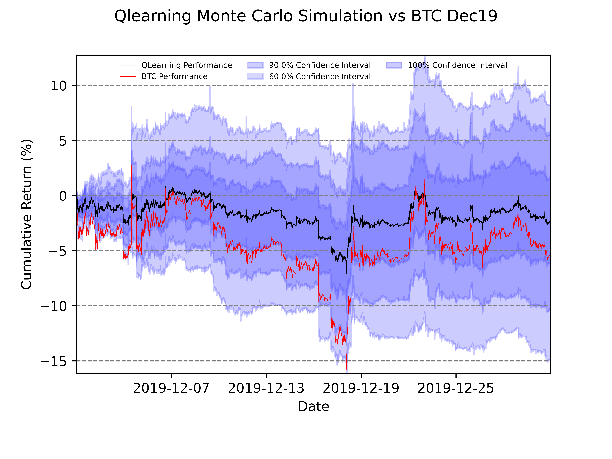

[](http://quantlet.de/)

## [](http://quantlet.de/) **SDA_2020_St_Gallen_04_VisualizeMonteCarlo** [](http://quantlet.de/)

```yaml


Name of Quantlet: SDA_2020_St_Gallen_04_VisualizeMonteCarlo

Published in: SDA_2020_St_Gallen_CryptoBot

Description: This quantlet is part of other quantlets and should ideally be executed after the quantlets before (see parent folders). Here the monte carlo simulations performed in the quantlet 'SDA_2020_St_Gallen_02_Simulations' are plotted. First, a plot showing the performance of the q-learning algorithm with 100 randomly generated initial q-tables. Second, a plot showing the performance of the q-learning algorithm in comaprison to a simple Buy and Hold and considers the confidence intervals. 

Keywords: QLearning, Monte Carlo, Trading Bot, BTC, Bitcoin, Timeseries, Technical Indicators

Author: Tobias Mann, Tim Graf

See also: SDA_2020_St_Gallen_01_DataImport, SDA_2020_St_Gallen_02_Simulations, SDA_2020_St_Gallen_03_VisualizeSimulations

Submitted:  'Sun , January 03 2020 by Tobias Mann and Tim Graf'

Datafile: ../SDA_2020_St_Gallen_02_Simulations/Output_Dec_2019/Dec19_MC_Paths.csv.gzip

Output:  ./Dec19.png, ./MONTECARLO_Dec_2019.png

```




### PYTHON Code
```python

import os
import pandas as pd
import numpy as np
from scipy import stats
import matplotlib.pyplot as plt
import matplotlib.dates as mdates
from matplotlib.dates import DateFormatter
import plotting


def test_average_performance(paths, data, threshold = .01, verbose = False):
    # This functin calculates the avgerage cumulative BTC return, and calculates the p-Value that the true cumulative simulation return is equal or below to BTC performance
    cumreturn=lambda x: x[-1]/x[0]-1
    btc = cumreturn(data.close.values)
    sumulation_cumreturns = paths.iloc[-1,:].values
    t, p = stats.ttest_1samp(sumulation_cumreturns, btc)
    if verbose:
        if btc > sumulation_cumreturns.mean():
            print(f"The strategy appears to perform worse on average than simply holding BTC")
        elif p < threshold:
            print(f"The t-Statistic for the simulations true cumulative return being identical to the the one of BTC is {round(t,4)}, the according p-Values is {round(p*100, 2)}% and below the {int(100*threshold)}% threshold!")
        else:
            print(f"The hypothesis of a significantly different performance is rejected at the {round(threshold*100,0)}% significance level")
    return (t, p)

if __name__ == "__main__":
    file = "../Data/Dec19.csv"
    paths_file = "../SDA_2020_St_Gallen_02_Simulations/Output_Dec_2019/Dec19_MC_Paths.csv"
    if os.path.exists(paths_file ):
        if os.path.exists(file):
            data = pd.read_csv(file)
            paths = pd.read_csv(paths_file).set_index("time")
            test_average_performance(paths, data, verbose=True)
            plotting.create_mc_dist_plot(paths.reset_index(), data, (.9, .6), output="./Dec19.png", title="Qlearning Monte Carlo Simulation vs BTC Dec19")
        else:
            print(f"File is mising: {file}")
    else:
        print("There is no data from a previous Monte Carlo Simulation. Please run first the simulation to generate the data")


# MONTE CARLO SIMULATION PLOT ----------------------------------------------

PATH_PLOTS = './'
TIMEPERIOD = 'Dec_2019'
FIGSIZE = (10,10)
TIME_FMT = mdates.DateFormatter('%d-%m-%Y')


# change the folder where the input is
df_mc = pd.read_csv('../SDA_2020_St_Gallen_02_Simulations/Output_Dec_2019/Dec19_MC_Paths.csv.gzip',  compression='gzip')
df_mc['time'] = pd.to_datetime(df_mc['time'])
df_mc_returns = df_mc.loc[:, df_mc.columns != 'time'].diff()

df = pd.read_csv('..//Data/Dec19.csv')
df['cumreturn'] = np.log(1 + df['close'].pct_change()).cumsum()
df['time'] = pd.to_datetime(df['time'])

# initiliaze figure
fig = plt.figure(num=None,
                 figsize=FIGSIZE,
                 dpi=80,
                 facecolor='w',
                 edgecolor='k')
plt.style.use('seaborn-darkgrid')

# create a color palette
palette = plt.get_cmap('Set1')

# format x axis
ax = plt.gca()
formatter = mdates.DateFormatter("%d-%m-%Y")
ax.xaxis.set_major_formatter(formatter)

# plot every X
counter = 0
for i in df_mc.columns:
    counter += 1
    if counter == 0:
        pass
    else:
        if counter % 2 == 0:
            ax.plot(df_mc.time, df_mc[i], alpha=0.2, linewidth=1)

ax.plot(df.time, df.cumreturn, label='BUY AND HOLD', linewidth=2)
plt.ylabel('Returns (in %)', fontsize=16)
plt.legend()

# show and plot
plt.show()
fig.savefig(PATH_PLOTS + 'MONTECARLO_' + TIMEPERIOD + '.png', dpi=1000)
```

automatically created on 2021-01-05