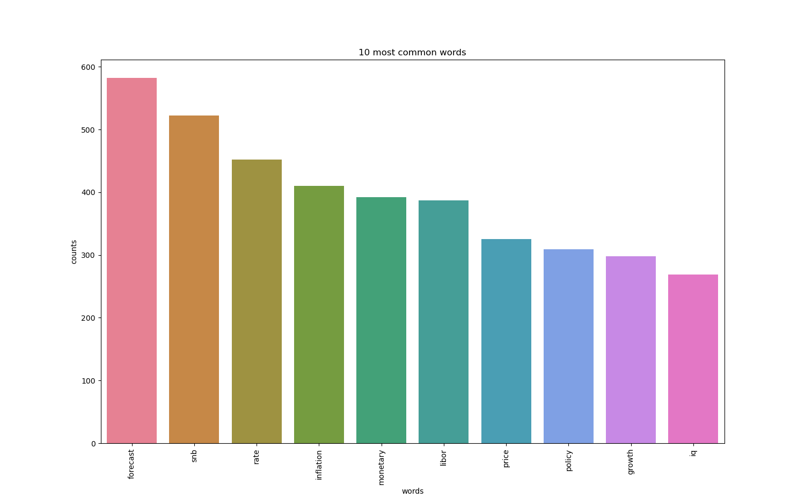

[](http://quantlet.de/)

## [](http://quantlet.de/) **SDA_2020_St_Gallen_02_Cleaning_EDA** [](http://quantlet.de/)

```yaml


Name of Quantlet: 'SDA_2020_St_Gallen_02_Cleaning_EDA'

Published in: 'SDA_2020_St_Gallen'

Description: 'Cleaning unstructured text data and performing an LDA analysis of quarterly Swiss National Bank Monetary Policy Assessments'

Keywords: 'Textmining, Cleaning, Sentiment, Analysis, Latent Dirichlet Allocation, Unsupervised Machine Learning, Topic Modeling'

Author: 'Stefan Diener, Jan Scheidegger'

Submitted:  '24. December 2020'

Input: 'articles_raw.xlsx'

Output: 'articles_clean.xlsx, wordcloud.png, most_common_words.png, LDA_visualization.html'

```




### PYTHON Code
```python

import os
import pandas as pd
import openpyxl  # install this dependency
import time
import matplotlib
from wordcloud import WordCloud

import re
from textblob import TextBlob
from nltk import WordNetLemmatizer
from nltk.tokenize import word_tokenize
from nltk.corpus import stopwords

from sklearn.feature_extraction.text import CountVectorizer
from sklearn.decomposition import LatentDirichletAllocation as LDA
import pyLDAvis
from pyLDAvis import sklearn as sklearn_lda
import numpy as np
import matplotlib.pyplot as plt
import seaborn as sns


# Needs to be downloaded once!
# import nltk
# nltk.download('stopwords')
# nltk.download('punkt')
# nltk.download('wordnet')

# Set working directory to file location
abspath = os.path.abspath(__file__)
dname = os.path.dirname(abspath)
os.chdir(dname)
# %% Functions
def clean_texts(text_col):
    start_time = time.time()
    print("Cleaning {} texts...".format(len(text_col)))

    # define stop words
    stop_words = set(stopwords.words('english'))
    stop_words.update(('wwwsnbchsnbsnbchzurich', 'press', 'relationspo', 'box', 'zurichtelephone',
                       'suisse', 'swiss', 'schweizerische', 'svizzera', 'national', 'nationale', 'naziunala',
                       'nazionale', 'bank', 'banca', 'nationalbankbanque', 'pcommunicationspo', 'ch', 'suissebanca',
                       'svizzerabanca', 'svizraswiss', 'release', 'svizrapress', 'communicationssnbchberne'))

    # clean on tweet level
    text_col = text_col.apply(lambda x: re.sub(r'', '', x))  #
    text_col = text_col.apply(lambda x: re.sub(r'\w+:\/{2}[\d\w-]+(\.[\d\w-]+)*(?:(?:\/[^\s/]*))*', '', x))  # rm links
    text_col = text_col.apply(lambda x: re.sub('[^A-Za-z0-9 ]+', '', x))  # remove special characters
    text_col = text_col.apply(lambda x: re.sub('[^A-Za-z ]+', '', x))  # remove numbers
    text_col = text_col.apply(lambda x: x.lower())  # convert to lower

    # Clean at word level
    tokens = text_col.apply(lambda x: [w for w in word_tokenize(x)])  # splits text_col into tokens / words.
    tokens = tokens.apply(lambda x: [w for w in x if w not in stop_words])  # remove stopwords
    tokens = tokens.apply(lambda x: [WordNetLemmatizer().lemmatize(t) for t in x])  # lemmatize tokens
    text_col = tokens.apply(lambda x: ' '.join(x))  # lemmatize tokens

    text_col = text_col.apply(lambda x: re.sub(r"\b[a-zA-Z]\b", "", x))  # remove all single

    print("Cleaning done --- runtime {} s ---".format(int(round(time.time() - start_time, 0))))

    return text_col


def get_polarity_subjectivity(text_col):
    start_time = time.time()
    print("Calculating polarity / subjectivity of {} texts...".format(len(text_col)))

    polarity = text_col.apply(lambda x: TextBlob(x).sentiment.polarity)
    subjectivity = text_col.apply(lambda x: TextBlob(x).sentiment.subjectivity)

    print("Calculation finished  --- runtime {} s ---".format(int(round(time.time() - start_time, 0))))

    return polarity, subjectivity


def plot_wordcloud(text_col):
    text = ' '.join(text_col)
    # stop_words = ["covid19", "coronavirus"]

    wordcloud = WordCloud(width=2000, height=1000, collocations=False).generate(text)

    plt.figure(figsize=(18, 10))
    plt.title("Top Words")
    plt.imshow(wordcloud, interpolation='bilinear')
    plt.axis("off")
    plt.savefig('wordcloud.png')


def plot_polarity_subjectivity_dist(sent_col):
    sns.distplot(sent_col)
    plt.title("Distribution of sentiment")
    plt.show()


def plot_polarity_subjectivity_dev(sent_col, date_col):
    dates = matplotlib.dates.date2num(date_col)
    matplotlib.pyplot.plot_date(dates, sent_col)
    plt.title("Polarity Score over time")
    plt.show()


# Helper function
def plot_10_most_common_words(count_data, count_vectorizer):
    words = count_vectorizer.get_feature_names()
    total_counts = np.zeros(len(words))
    for t in count_data:
        total_counts += t.toarray()[0]

    count_dict = (zip(words, total_counts))
    count_dict = sorted(count_dict, key=lambda x: x[1], reverse=True)[0:10]
    words = [w[0] for w in count_dict]
    counts = [w[1] for w in count_dict]
    x_pos = np.arange(len(words))

    plt.figure(2, figsize=(15, 15 / 1.6180))
    plt.subplot(title='10 most common words')
    sns.set_context("notebook", font_scale=1.25, rc={"lines.linewidth": 2.5})
    sns.barplot(x_pos, counts, palette='husl')
    plt.xticks(x_pos, words, rotation=90)
    plt.xlabel('words')
    plt.ylabel('counts')
    plt.savefig('most_common_words.png')


# Helper function
def print_topics(model, count_vectorizer, n_top_words):
    words = count_vectorizer.get_feature_names()
    for topic_idx, topic in enumerate(model.components_):
        print("\nTopic #%d:" % topic_idx)
        print(" ".join([words[i]
                        for i in topic.argsort()[:-n_top_words - 1:-1]]))


def train_plot_LDA(df):
    # Initialise the count vectorizer with the English stop words
    count_vectorizer = CountVectorizer(stop_words='english')
    # Fit and transform the processed titles
    count_data = count_vectorizer.fit_transform(df['text_clean'])
    # Visualise the 10 most common words
    plot_10_most_common_words(count_data, count_vectorizer)

    # Tweak the two parameters below
    number_topics = 8
    number_words = 10
    # Create and fit the LDA model
    lda = LDA(n_components=number_topics, n_jobs=-1)
    lda.fit(count_data)
    # Print the topics found by the LDA model
    print("Topics found via LDA:")
    print_topics(lda, count_vectorizer, number_words)

    import warnings
    warnings.simplefilter("ignore", DeprecationWarning)

    LDAvis_prepared = sklearn_lda.prepare(lda, count_data, count_vectorizer)
    pyLDAvis.save_html(LDAvis_prepared, './LDA_visualization.html')


# %% Main
def main():
    # Cleaning
    df = pd.read_excel('articles_raw.xlsx', index_col=0, engine='openpyxl')
    df['date'] = pd.to_datetime(df['date'])

    df['text_clean'] = clean_texts(df['text'])
    df['polarity'], df['subjectivity'] = get_polarity_subjectivity(df['text_clean'])

    df = df.groupby('filename').agg({'date': 'first',
                                     'polarity': 'mean',
                                     'subjectivity': 'mean',
                                     'text': lambda x: ''.join(x),
                                     'text_clean': lambda x: ','.join(x)})

    df.to_excel('articles_clean.xlsx', engine='xlsxwriter')

    # EDA
    pd.Series(' '.join(df['text']).split()).value_counts()[:10].plot.bar()
    pd.Series(' '.join(df['text_clean']).split()).value_counts()[:10].plot.bar()
    plot_wordcloud(df['text_clean'])
    plot_polarity_subjectivity_dist(df['polarity'])
    plot_polarity_subjectivity_dev(df['polarity'], df['date'])
    train_plot_LDA(df)


# %% Run file
if __name__ == '__main__':
    main()

```

automatically created on 2020-12-29