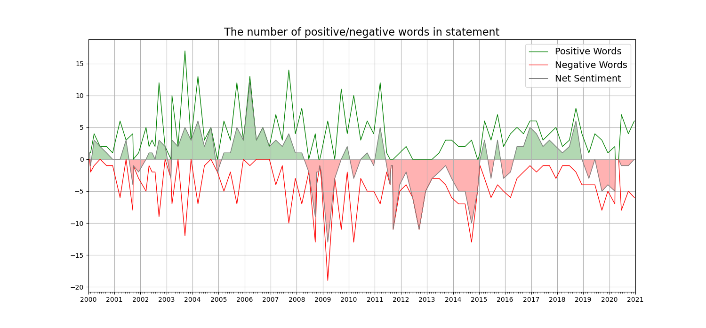

[](http://quantlet.de/)

## [](http://quantlet.de/) **SDA_2020_St_Gallen_03_Sentiment_Analysis** [](http://quantlet.de/)

```yaml


Name of Quantlet: 'SDA_2020_St_Gallen_03_Sentiment_Analysis'

Published in: 'SDA_2020_St_Gallen'

Description: 'Building a sentiment indicator with counts of positive and negative words of the SNB monetary policy assessments'

Keywords: 'Textmining, Dictionary-based Sentiment Analysis, Classification'

Author: 'Stefan Diener, Jan Scheidegger'

Submitted:  '24. December 2020'

Input: ' fed_dict.pickle, negate.pickle, articles_clean.xlsx'

Output: 'NetSentiment.csv, count_words.png'

```



### PYTHON Code
```python

import pandas as pd
import os
import re
import numpy as np
import pickle
import matplotlib.pyplot as plt
import matplotlib.dates as mdates

# Set working directory to file location
abspath = os.path.abspath(__file__)
dname = os.path.dirname(abspath)
os.chdir(dname)

# 1: FED Financial Stability dictionary(2017)
# Cite as: Correa, R. Garud, K. Londono, J, and Mislang, N. (2017). "Sentiment in central bank's financial stability reports"
# https://www.federalreserve.gov/econres/notes/ifdp-notes/constructing-a-dictionary-for-financial-stability-20170623.htm
with open('fed_dict.pickle', 'rb') as handle:
    fed_dict = pickle.load(handle)

# 2: negate dictionary
with open('negate.pickle', 'rb') as handle:
    negate = pickle.load(handle)

data = pd.read_excel('articles_clean.xlsx', engine='openpyxl')  # import from 03_Cleaning_EDA the cleaned data df

# Dictionary tone assessment will compare them by Index (need the numbers back)
data['Index'] = range(0, len(data))

# Make 'date' column as the index of Data
data.set_index(['date'], inplace=True)
data.head()


def negated(word):
    """
    Determine if preceding word is a negation word
    """
    if word.lower() in negate:
        return True
    else:
        return False


def tone_count_with_negation_check(dict, article):
    """
    Count positive and negative words with negation check. Account for simple negation only for positive words.
    Simple negation is taken to be observations of one of negate words occurring within three words
    preceding a positive words.
    """
    pos_count = 0
    neg_count = 0

    pos_words = []
    neg_words = []

    input_words = re.findall(r'\b([a-zA-Z]+n\'t|[a-zA-Z]+\'s|[a-zA-Z]+)\b', article.lower())

    word_count = len(input_words)

    for i in range(0, word_count):
        if input_words[i] in dict['Negative']:
            neg_count += 1
            neg_words.append(input_words[i])
        if input_words[i] in dict['Positive']:
            if i >= 3:
                if negated(input_words[i - 1]) or negated(input_words[i - 2]) or negated(input_words[i - 3]):
                    neg_count += 1
                    neg_words.append(input_words[i] + ' (with negation)')
                else:
                    pos_count += 1
                    pos_words.append(input_words[i])
            elif i == 2:
                if negated(input_words[i - 1]) or negated(input_words[i - 2]):
                    neg_count += 1
                    neg_words.append(input_words[i] + ' (with negation)')
                else:
                    pos_count += 1
                    pos_words.append(input_words[i])
            elif i == 1:
                if negated(input_words[i - 1]):
                    neg_count += 1
                    neg_words.append(input_words[i] + ' (with negation)')
                else:
                    pos_count += 1
                    pos_words.append(input_words[i])
            elif i == 0:
                pos_count += 1
                pos_words.append(input_words[i])

    results = [word_count, pos_count, neg_count, pos_words, neg_words]

    return results


# %% Count the positive and negative words using dictionary lm_dict or fed_dict
temp = [tone_count_with_negation_check(fed_dict, x) for x in data.text_clean]  # use lm_dict otherwise
temp = pd.DataFrame(temp)

data['wordcount'] = temp.iloc[:, 0].values
data['NPositiveWords'] = temp.iloc[:, 1].values
data['NNegativeWords'] = temp.iloc[:, 2].values

# Sentiment Score normalized by the number of words
data['sentiment'] = (data['NPositiveWords'] - data['NNegativeWords']) / data['wordcount'] * 100

data['Poswords'] = temp.iloc[:, 3].values
data['Negwords'] = temp.iloc[:, 4].values

# %%  Plot Sentiment analysis -------------------------------------------------------------------------------------------------------
NetSentiment = data['NPositiveWords'] - data['NNegativeWords']
NetSentiment.to_csv('NetSentiment.csv')  # save the sentiment indicator

plt.figure(figsize=(15, 7))
ax = plt.subplot()

plt.plot(data.index, data['NPositiveWords'], c='green', linewidth=1.0)
plt.plot(data.index, data['NNegativeWords'] * -1, c='red', linewidth=1.0)
plt.plot(data.index, NetSentiment, c='grey', linewidth=1.0)

plt.title('The number of positive/negative words in statement', fontsize=16)
plt.legend(['Positive Words', 'Negative Words', 'Net Sentiment'], prop={'size': 14}, loc=1)

ax.fill_between(data.index, NetSentiment, where=(NetSentiment > 0), color='green', alpha=0.3, interpolate=True)
ax.fill_between(data.index, NetSentiment, where=(NetSentiment <= 0), color='red', alpha=0.3, interpolate=True)

years = mdates.YearLocator()  # every year
months = mdates.MonthLocator()  # every month
years_fmt = mdates.DateFormatter('%Y')

# format the ticks
ax.xaxis.set_major_locator(years)
ax.xaxis.set_major_formatter(years_fmt)
ax.xaxis.set_minor_locator(months)

datemin = np.datetime64(data.index[0], 'Y')
datemax = np.datetime64(data.index[-1], 'Y') + np.timedelta64(1, 'Y')
ax.set_xlim(datemin, datemax)

ax.grid(True)

plt.savefig('count_words.png')

```

automatically created on 2020-12-29