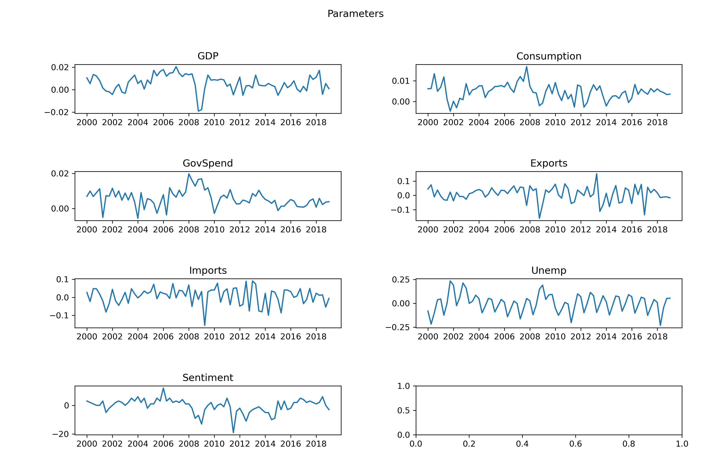
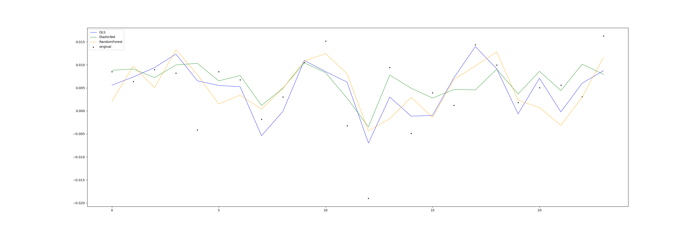

[](http://quantlet.de/)

## [](http://quantlet.de/) **SDA_2020_St_Gallen_04_Forecasting** [](http://quantlet.de/)

```yaml


Name of Quantlet: 'SDA_2020_St_Gallen_04_Forecasting'

Published in: 'SDA_2020_St_Gallen'

Description: 'Using a sentiment indicator build from SNB monetary policy assessments to forecast Switzerlands GDP'

Keywords: 'Linear Regression, Forecasting, ElasticNet, RandomForestRegressor, GridSearch'

Author: 'Stefan Diener, Jan Scheidegger'

Submitted:  '24. December 2020'

Input: 'NetSentiment.csv, Macroeconomic time series data automatically downloaded from "Fred" API'

Output: 'economic_variables.png, model_results.png, gridsearch_ElasticNet.pkl, gridsearch_LinearRegression.pkl, gridsearch_RandomForestRegressor.pkl'

```






### PYTHON Code
```python

import pickle

import pandas as pd
import numpy as np
from matplotlib import pyplot as plt
import pandas_datareader.data as web
import datetime

from sklearn.ensemble import RandomForestRegressor
from sklearn.linear_model import ElasticNet, LinearRegression
from sklearn.metrics import mean_squared_error, r2_score
from sklearn.model_selection import train_test_split, GridSearchCV

# %% Download macro data -------------------------------------------------------------------------------------

# import data from fred
start = datetime.datetime(1999, 9, 1)  # sentiment indicator starts from 2000
end = datetime.date.today()

GDP_data = web.DataReader('CPMNACSAB1GQCH', 'fred', start, end).to_period(
    'Q')  # Gross Domestic Product for Switzerland (CPMNACSAB1GQCH)
Unemp_data = web.DataReader('LMUNRRTTCHQ156N', 'fred', start, end).to_period(
    'Q')  # Registered Unemployment Rate for Switzerland (LMUNRRTTCHQ156N)
rec_indicator = web.DataReader('CHEREC', 'fred', start, end).to_period(
    'Q')  # OECD based Recession Indicators for Switzerland from the Period following the Peak through the Trough (
# CHEREC)
Import_data = web.DataReader('CHEIMPORTQDSMEI', 'fred', start, end).to_period(
    'Q')  # Imports of Goods and Services in Switzerland (CHEIMPORTQDSMEI)
Export_data = web.DataReader('CHEEXPORTQDSMEI', 'fred', start, end).to_period(
    'Q')  # Exports of Goods and Services in Switzerland (CHEEXPORTQDSMEI)
GovSpend_data = web.DataReader('CHEGFCEQDSMEI', 'fred', start, end).to_period(
    'Q')  # Government Final Consumption Expenditure in Switzerland (CHEGFCEQDSMEI)
Consumption_data = web.DataReader('CHEPFCEQDSMEI', 'fred', start, end).to_period(
    'Q')  # Private Final Consumption Expenditure in Switzerland (CHEPFCEQDSMEI)

# import the sentiment indicator
NetSentiment_data = pd.read_csv('NetSentiment.csv').rename(columns={'date': 'DATE', '0': 'Sentiment'})
NetSentiment_data['DATE'] = pd.to_datetime(NetSentiment_data['DATE']).dt.to_period('Q')  # transform date into quarter
NetSentiment_data = NetSentiment_data.groupby('DATE').sum()

GDP_data = np.log(GDP_data).diff()
Consumption_data = np.log(Consumption_data).diff()
GovSpend_data = np.log(GovSpend_data).diff()
Export_data = np.log(Export_data).diff()
Import_data = np.log(Import_data).diff()
Unemp_data = np.log(Unemp_data).diff()

# Construct final DataFrame
data = [GDP_data, Consumption_data, GovSpend_data, Export_data, Import_data, Unemp_data, NetSentiment_data]
data = pd.concat(data, axis=1)
data.columns = ["GDP", "Consumption", "GovSpend", "Exports", "Imports", "Unemp", 'NetSentiment']
data.index = data.index.to_timestamp()

# remove NA caused by growth rate calculation
data = data.dropna()
data.isna().sum()

# plot data
fig, axs = plt.subplots(4, 2)
fig.suptitle('Parameters')
axs[0, 0].plot(data.GDP)
axs[0, 0].set_title("GDP")
axs[0, 1].plot(data.Consumption)
axs[0, 1].set_title("Consumption")
axs[1, 0].plot(data.GovSpend)
axs[1, 0].set_title("GovSpend")
axs[1, 1].plot(data.Exports)
axs[1, 1].set_title("Exports")
axs[2, 0].plot(data.Imports)
axs[2, 0].set_title("Imports")
axs[2, 1].plot(data.Unemp)
axs[2, 1].set_title("Unemp")
axs[3, 0].plot(data.NetSentiment)
axs[3, 0].set_title("Sentiment")
fig.tight_layout()

fig.set_size_inches(12, 8)

fig.savefig('economic_variables.png', dpi=300)

# %% Model Prep

# split data into X / Y
Y = data['GDP']
X = data.loc[:, data.columns != 'GDP']

# Split data into train / test
X_train, X_test, y_train, y_test = train_test_split(X, Y, test_size=0.3, random_state=2020)

# %% Model Train

# specify models and parameters
model_OLS = LinearRegression()
param_OLS = {'fit_intercept': [True, False],
             'normalize': [True, False]}

model_ELN = ElasticNet()
param_ELN = {'alpha': [0.0001, 0.001, 0.01, 0.1, 0.3, 0.5, 0.7, 1]}

model_RF = RandomForestRegressor()
param_RF = {
    'bootstrap': [True, False],
    'max_depth': [10, 50, 100, 500, 1000],
    'min_samples_split': [2, 5, 10],
    'n_estimators': [10, 100, 500]
}

# gridsearch + predictions from best model
grid_OLS = GridSearchCV(model_OLS, param_OLS, cv=5, verbose=0, n_jobs=-1, return_train_score=True)
grid_OLS = grid_OLS.fit(X_train, y_train)
y_pred_OLS = grid_OLS.predict(X_test)

grid_ELN = GridSearchCV(model_ELN, param_ELN, cv=5, verbose=0, n_jobs=-1, return_train_score=True)
grid_ELN = grid_ELN.fit(X_train, y_train)
y_pred_ELN = grid_ELN.predict(X_test)

grid_RF = GridSearchCV(model_RF, param_RF, cv=5, verbose=0, n_jobs=-1, return_train_score=True)
grid_RF = grid_RF.fit(X_train, y_train)
y_pred_RF = grid_RF.predict(X_test)

# evaluate models
models = [model_OLS, model_ELN, model_RF]
parameters = [param_OLS, param_ELN, param_RF]
grids = [grid_OLS, grid_ELN, grid_RF]
y_preds = [y_pred_OLS, y_pred_ELN, y_pred_RF]

# calculate scores
for model, param, grid, y_pred in zip(models, parameters, grids, y_preds):
    name = type(model).__name__
    print("Tuning Hyperparameters: {}".format(name))

    #print("Score: ", grid.score(y_test, y_pred))
    print("MSE: ", mean_squared_error(y_test, y_pred))
    print("R2: ", r2_score(y_test, y_pred))

    with open("gridsearch_{}.pkl".format(name), 'wb') as file:
        pickle.dump(grid, file)

# %% Plot results
plt.figure(figsize=(30, 10))
x_ax = range(len(X_test))
plt.scatter(x_ax, y_test, s=5, color='black', label='original')
plt.plot(x_ax, y_pred_OLS, lw=0.8, color='blue', label='OLS')
plt.plot(x_ax, y_pred_ELN, lw=0.8, color='green', label='ElasticNet')
plt.plot(x_ax, y_pred_RF, lw=0.8, color='orange', label='RandomForest')
plt.legend()
plt.savefig('model_results.png')
```

automatically created on 2020-12-29